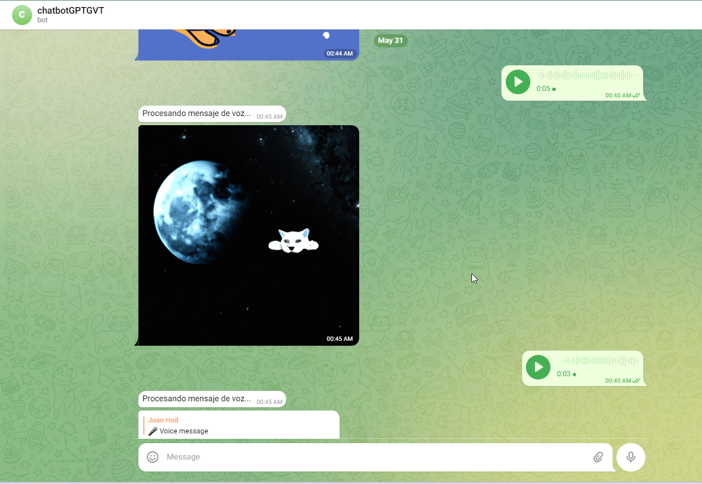

# ChatGPT-Telegram-Whatsapp-Bot

## Description

Send audio messages or write texts through a system that is capable of detecting voice commands and translating them, or understanding descriptions to generate images. This technology uses voice recognition and natural language processing to interpret what you say or write, and then performs the corresponding action, whether it's translating your words into phrases in another language or creating images based on your descriptions. It's an advanced way of interacting with technology that allows you to effectively transform your ideas into text or images.

 <!-- alt = img -thumbnail -->


> ChatGPT and Telegram bot, Whatsapp bot, based on Node.js.
- [Description](#Description)
- [How to use](#how-to-use)
- [How to deploy](#how-to-deploy)
  - [Locally](#locally)
  - [Docker](#docker)


## How to use

Send a message directly to the bot and a conversation thread will be created automatically.

# Telegram
If you wish to reset thread, you can use `/start` command.
# Whatsapp
Add another device by scanning the QR code to start the WhatsApp bot.


Send audio messages or write texts through a system that is capable of detecting voice commands and translating them, or understanding descriptions to generate images.



## How to deploy

### Locally

1. Copy the `.env` file to `.env.prod`,

   1. Add Telegram bot token to `TELEGRAM_BOT_TOKEN` ([How to create a Telegram bot](https://learn.microsoft.com/en-us/azure/bot-service/bot-service-channel-connect-telegram)）
   2. Add ChatGPT token to `CHATGPT_TOKEN` ([How to get ChatGPT token](https://platform.openai.com/account/api-keys))

2. Execute the command

```bash
# install dependencies
npm install

# Start the bot service
npm run dev

```

### Docker

```bash
# Pull image
docker build -t nombre_de_la_imagen .


# Run
docker run -d -p 9001:9001 -e TELEGRAM_BOT_TOKEN=xxx -e CHATGPT_TOKEN=xxxx nombre_de_la_imagen
```

## License

MIT © juanhoil
